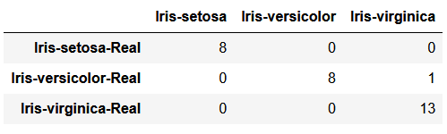

# Decision Tree Algorithm
Implementation of decision tree algorithm for classification using Iris Dataset. Here at every depth feature with largest information gain(based on entropy) is selected for making the split. The mean value of a feature is used to make binary split of the dataset.

## Dataset Description
The Iris dataset can be found on the UCI Machine Learning Repository. It includes three iris species (Iris-setosa, Iris-versicolor and Iris-virginica) with 50 samples each as well as some properties about each flower.

The columns in this dataset are:
* Id
* SepalLengthCm
* SepalWidthCm
* PetalLengthCm
* PetalWidthCm
* Species

## Results
One fifth of dataset (30 samples) are used for testing purpose and model predicted with 96.67% test accuracy.
